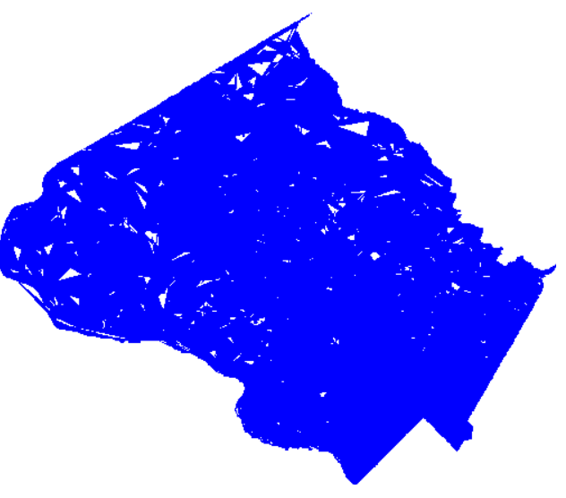

# C-Patterns 

A library that allows the visualization of Census information. 

## Drawing Shapes

A shape consists of multiple smaller polygons. 
To read a shape file from a .shp file 
```python
from shpReader import ShapeFile
import draw
import util
import pygame

fileName = "data/Moco/tl_2014_24031_faces.shp"
running = True

s = ShapeFile(fileName).shape


minX, minY, maxX, maxY = util.calcExtrema(s.polyList)

draw.initPygame()

for i in range(len(s.polyList)):
    draw.drawPointsPygame(s.polyList[i].points,minX,minY,maxX, maxY,outline=False)


while running:
    for event in pygame.event.get():
        if event.type == pygame.QUIT:
            running = False
            pygame.quit()
            break

```



